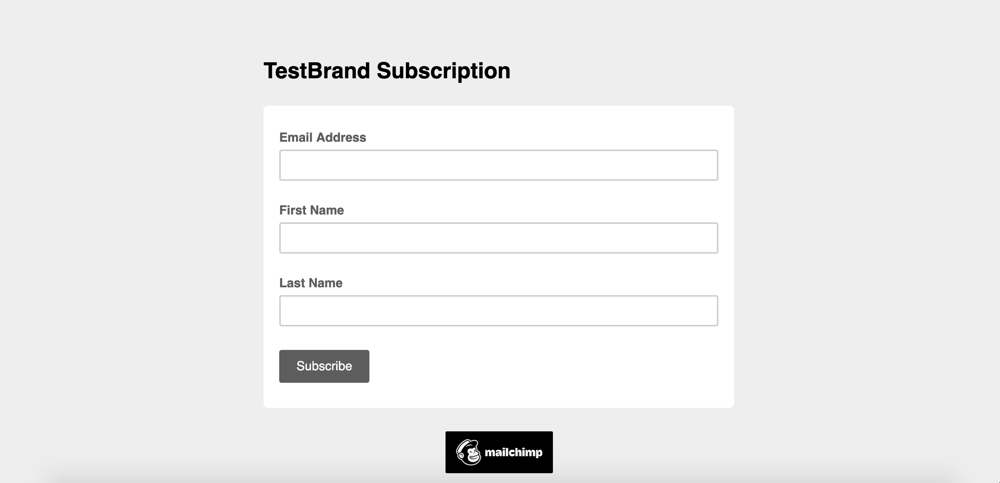

# Mock Landing Page

This is an excercise from a full-stack web development course provided by Udemy to introduce HTML, CSS, and Bootstrap to students. I was required to develop a mock registration page integrated with MailChimp to allow users to register their information.

## Instructions:

Simply press this **Link:** https://kouitayakul.github.io/Mock-Landing-Page/ to visit the page.

## Demo:

Here are screenshots of what the page looks like:

## Tech/Framework used:

Built with:

- HTML
- CSS
- Bootstrap
- JavaScript

## Credits:

Thanks to Udemy for providing this excercise and allow me to develop my web development skills. I was able to experience a glimpse of what it's like to build a website using HTML, CSS, BootStrap, & JavaScript.

